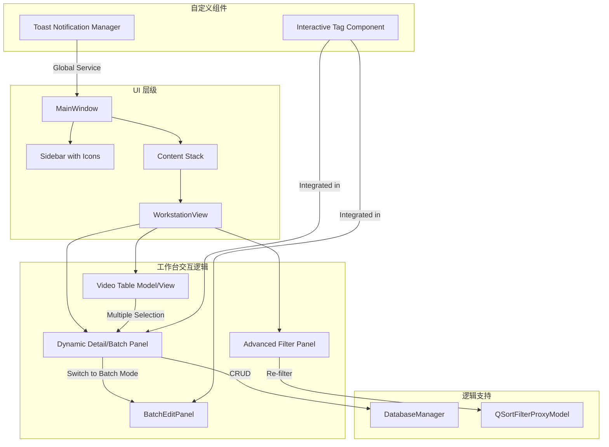

# UI 高级优化与标签管理功能增强方案

本方案旨在提升 `Video Organizer Pro` 的视觉体验与交互效率，重点解决标签管理的便捷性、多视频批量处理能力以及筛选功能的深度集成。

## 1. 核心设计要点汇总

### 1.1 视觉美化 (Visual Enhancement)
*   **自定义 QSS 体系**: 
    *   引入全局变量定义的 QSS 样式表，支持圆角 (8px - 12px) 和微弱的线性渐变背景（侧边栏使用 `#1e1e2f` 到 `#2d2d44` 的渐变）。
    *   **侧边栏升级**: 
        *   每个导航项增加图标展示（建议集成 `qtawesome` 或使用 SVG 图标资源）。
        *   增加 `:hover` 悬停动效：背景色平滑过渡（`transition` 效果）及左侧蓝色高亮条。
*   **现代控件风格**:
    *   所有按钮增加按下和禁用状态的样式区分。
    *   滚动条自定义样式，采用窄长、圆角且半透明的设计，减少视觉干扰。

### 1.2 交互式标签组件 (Interactive Tag Component)
*   **TagFlowWidget 实现**:
    *   基于 `QFlowLayout`（自定义布局类）自动换行显示标签气泡。
    *   每个标签气泡（TagChip）包含文本和点击删除图标。
*   **智能输入逻辑**:
    *   输入框集成 `QCompleter`，自动提取 `tags_library` 数据库表及 `settings.json` 中的现有维度标签作为建议项。
    *   支持回车或逗号自动转为气泡。

### 1.3 批量管理模式 (Batch Processing)
*   **上下文切换逻辑**:
    *   当用户在视频表格中勾选超过一个视频时，右侧详情面板自动平滑切换到 `BatchEditPanel`。
    *   **核心功能**:
        *   **统一分类**: 一键修改所有选中视频的分类。
        *   **合并标签**: 支持“追加”模式（在现有标签后添加新标签）和“覆盖”模式。
        *   **批量状态变更**: 快速标记选中项为“已审核”或“待重命名”。

### 1.4 数据筛选增强 (Advanced Filtering)
*   **侧边折叠筛选面板**:
    *   位于工作台左侧或顶部。包含日期范围选择器、分类多选下拉框、标签云（点击过滤）。
*   **搜索增强**:
    *   重写 `QSortFilterProxyModel.filterAcceptsRow`，支持多维度复合筛选（如：分类=生活 AND 标签包含"美食"）。

### 1.5 快速预览与反馈 (Preview & Feedback)
*   **快速预览**: 
    *   详情面板缩略图支持双击，通过 `QDesktopServices.openUrl` 快速调用系统默认播放器预览原始视频。
*   **精致状态反馈**:
    *   **Toast 通知**: 右下角弹出式通知，用于显示“分析完成”、“保存成功”等即时消息。
    *   **彩色状态标签**: 表格“状态”列根据内容（如 `analyzed`, `edited`, `renamed`）显示不同背景色的圆角标签。

---

## 2. 系统架构示意图 (Mermaid)



---

## 3. 核心 QSS 样式示例

```css
/* 侧边栏项美化 */
#sidebar QListWidget::item {
    padding: 12px 20px;
    border-radius: 8px;
    margin: 4px 10px;
    color: #a9b7c6;
    background: transparent;
}

#sidebar QListWidget::item:hover {
    background-color: rgba(61, 90, 254, 0.1);
}

#sidebar QListWidget::item:selected {
    background: qlineargradient(x1:0, y1:0, x2:1, y2:0, stop:0 #3d5afe, stop:1 #536dfe);
    color: white;
}

/* 标签气泡样式 */
.TagChip {
    background-color: #323232;
    border: 1px solid #444;
    border-radius: 15px;
    padding: 4px 10px;
    color: #e0e0e0;
}

/* 状态标签配色 */
.status-analyzed { background-color: #2e7d32; color: white; }
.status-edited { background-color: #f57c00; color: white; }
.status-duplicate { background-color: #c62828; color: white; }
```

---

## 4. 实施路径

1.  **第一阶段 (自定义组件)**: 实现 `TagFlowWidget` 和 `ToastNotification` 基础类。
2.  **第二阶段 (视觉刷新)**: 编写完整 QSS 文件并在 `main()` 中加载，替换侧边栏 QListWidget 逻辑。
3.  **第三阶段 (批量逻辑)**: 在 `WorkstationView` 中实现面板切换机制及 `BatchEditPanel`。
4.  **第四阶段 (筛选与预览)**: 集成高级筛选面板，实现缩略图双击预览。
