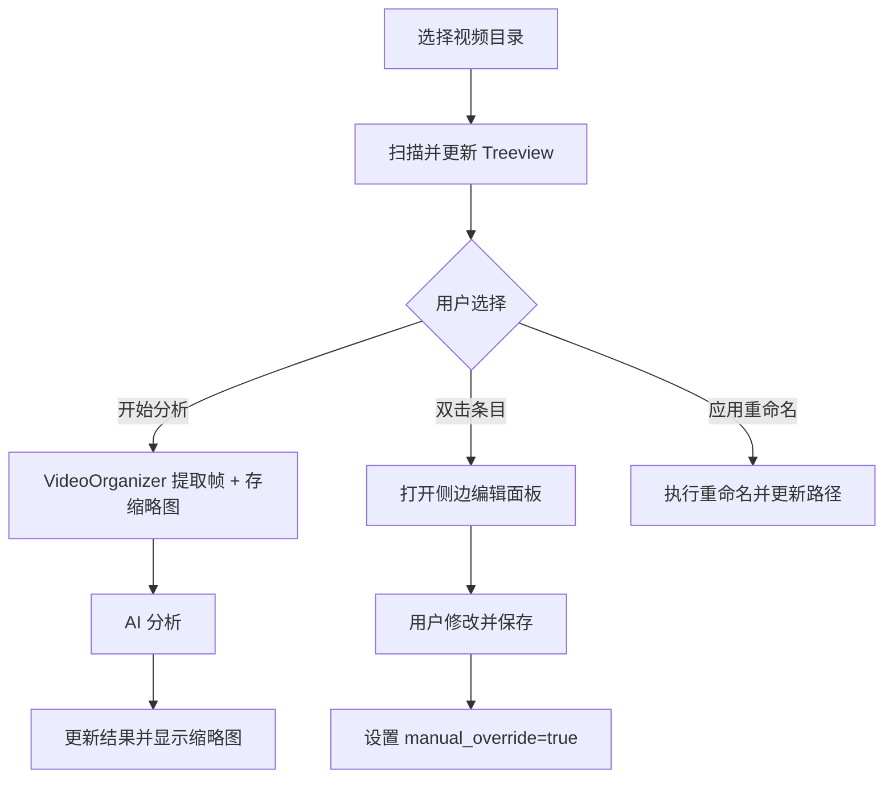

# AI 视频整理工具 GUI V2 技术规范

## 1. 概述
本文档详细说明了 AI 视频整理工具 GUI V2 的功能增强和技术实现方案。重点在于提升标签编辑体验、引入交互式结果管理、增加缩略图预览以及增强后端对手动干预的支持。

## 2. 界面设计 (GUI V2)

### 2.1 工作台 (Workspace) 增强
*   **交互式表格 (Treeview)**:
    *   列定义: `文件名`, `分类`, `摘要`, `标签`, `状态`。
    *   状态值: `待处理`, `已分析`, `已编辑`, `已重命名`。
    *   **双击编辑**: 双击行时，在侧边栏或弹窗中打开编辑器。
*   **侧边详情面板 (Side Panel)**:
    *   **缩略图预览**: 显示视频中提取的代表性帧（使用 `Pillow` 处理）。
    *   **字段编辑器**: 可直接修改 AI 生成的分类、摘要和标签。
    *   **手动覆盖标志**: 一旦用户手动修改，该条目将被标记为 `manual_override=true`，防止 AI 重新运行覆盖。
*   **过滤与搜索**:
    *   表格上方增加搜索框（按文件名或关键词过滤）。
    *   增加分类过滤器（下拉菜单）。
*   **多选操作**:
    *   支持 Ctrl/Shift 多选。
    *   按钮支持: `处理选中`, `重命名选中`, `删除选中结果`。

### 2.2 标签管理 (Tag Management) 增强
*   **分类-标签联动编辑器**:
    *   左侧列表显示所有分类。
    *   点击分类时，右侧显示该分类下的固定标签及 "Learned Tags"。
    *   支持按钮添加/删除标签，不再需要手动编辑 JSON 文本。
*   **学习标签 (Learned Tags) 管理**:
    *   专门展示 AI 在 `Key Objects` 维度发现的新标签。
    *   用户可点击“加入库”将其转为正式标签。

## 3. 后端支持 (Backend)

### 3.1 缩略图系统
*   **存储**: 在工作目录下创建 `.thumbnails` 隐藏文件夹。
*   **逻辑**: 在 `VideoProcessor.extract_frames` 过程中，将第一帧保存为 JPG 格式，文件名为视频文件的 MD5 或 Base64 编码名。
*   **生命周期**: 随分析结果创建，随分析结果删除。

### 3.2 数据模型更新
*   `video_analysis_results.json` 结构扩展：
    ```json
    {
      "path": "...",
      "filename": "...",
      "category": "...",
      "summary": "...",
      "tags": ["...", "...", "...", "...", "..."],
      "status": "analyzed",
      "manual_override": false,
      "thumbnail_path": ".thumbnails/..."
    }
    ```

### 3.3 逻辑支持
*   `VideoOrganizer.run_analysis(targets: List[str])`: 支持仅分析指定路径列表。
*   `FileManager.update_item(filename, updates: Dict)`: 支持更新单条结果。

## 4. 技术栈
*   **GUI**: `tkinter` + `ttk` (保持轻量)。
*   **图像处理**: `Pillow` (PIL) - 用于加载缩略图并调整 UI 显示尺寸。
*   **并发**: `threading` + `Queue` (确保 UI 不卡顿)。

## 5. 交互流程图


