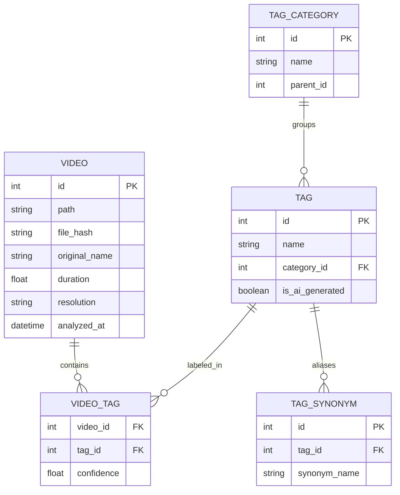

# AI Video Organizer v3.0: Mega Update Technical Masterplan

## 1. 概述
本项目旨在将现有的基础视频整理工具升级为企业级的 AI 视频资产管理系统 (MAM)。核心目标是通过 SQLite 存储、多进程并发、深度 AI 集成以及极致的性能优化，提供更强大的标签管理、搜索和自动化处理能力。

## 2. 核心架构升级

### 2.1 存储层迁移 (JSON -> SQLite)
目前的 `video_analysis_results.json` 将迁移到 `video_manager.db`。
- **优势**: 支持复杂查询、事务安全、索引加速、多表关联（标签/同义词）。
- **技术栈**: `sqlite3` + `SQLAlchemy` (可选) + `FTS5` (全文搜索)。

### 2.2 并发模型重构
- **主进程**: GUI 交互 (Tkinter/CustomTkinter)。
- **分析线程池**: 处理 I/O 密集型任务 (API 调用)。
- **计算进程池**: 处理 CPU 密集型任务 (OpenCV 抽帧、哈希计算、Face Detection)。
- **消息队列**: 使用 `queue.Queue` 进行进程/线程间同步。

## 3. 20+ 高级功能清单

| 功能名称 | 技术实现方案 | 备注 |
| :--- | :--- | :--- |
| 1. 场景检测 (Scene Detection) | 使用 `PySceneDetect` 库识别切镜，提取每段场景的关键帧。 | 提高分析准确度 |
| 2. 音频转录 (Whisper) | 集成 `openai-whisper` (本地) 或 API，实现视频语音搜索。 | 支持字幕生成 |
| 3. 多模型共识验证 | 同时请求 GPT-4o, Claude, Gemini，通过投票算法确定最终标签。 | 消除 AI 幻觉 |
| 4. NLE 格式导出 | 生成 FCPX (XML) 或 Premiere (EDL) 文件，将标签带入剪辑软件。 | 工作流集成 |
| 5. 智能文件夹 (Smart Folders) | 基于 SQL 查询的虚拟视图，如“2024年所有包含大海的 4K 视频”。 | 动态组织 |
| 6. 批量处理过滤器 | 按分辨率、编码、码率、长度等元数据进行高级筛选。 | `ffprobe` 集成 |
| 7. 元数据注入 (XMP) | 使用 `exiftool` 将 AI 标签写入视频文件的 XMP 元数据区。 | 跨软件通用 |
| 8. 知觉哈希去重 | `ImageHash` (pHash/dHash) 计算视频指纹，发现重复内容。 | 节省空间 |
| 9. 暗黑模式与自定义主题 | 引入 `CustomTkinter` 替换原生 Tkinter 控件。 | 视觉升级 |
| 10. 拖拽支持 | 集成 `TkinterDnD2` 支持文件夹和文件的拖拽导入。 | 交互优化 |
| 11. 时间轴撤销管理器 | 基于数据库事务的 Undo/Redo，支持查看重命名历史记录。 | 安全保障 |
| 12. 人脸识别与聚类 | `InsightFace` 或 `face_recognition` 提取特征，按人物分类。 | 自动人物标签 |
| 13. 文字识别 (OCR) | `PaddleOCR` 提取视频中的标题、PPT 文字或路牌。 | 文本索引 |
| 14. 故事板生成 | 自动生成包含时间戳的联系表 (Contact Sheet) 缩略图。 | 快速浏览 |
| 15. 插件系统 | 基于 `yapsy` 或自定义 `__import__` 机制支持自定义分析脚本。 | 扩展性 |
| 16. 自然语言语义搜索 | 使用 `CLIP` 向量索引，支持“寻找夕阳下的奔跑”这类描述。 | 向量数据库 |
| 17. 代理文件 (Proxy) 生成 | 使用 `FFmpeg` 自动生成低分辨率小文件用于预览。 | 性能平衡 |
| 18. 转场检测 | 识别淡入淡出、闪白等特效转场。 | 剪辑辅助 |
| 19. 色相环提取 | 提取每段视频的主色调 (Dominant Colors)，支持按色系搜索。 | 视觉搜索 |
| 20. 云端同步 (Metadata Only) | 将本地 SQLite 数据同步至 S3 或 WebDAV。 | 多机协作 |
| 21. 动作识别 | 识别视频中的特定动作 (跑步、谈话、驾驶)。 | 深度标签 |
| 22. 画质评估 | 自动检测模糊、噪点、花屏或死像素。 | 自动初剪 |

## 4. 20+ 性能优化清单

| 优化项 | 实现方式 | 预期收益 |
| :--- | :--- | :--- |
| 1. 多进程抽帧 | 使用 `ProcessPoolExecutor` 绕过 GIL，并行读取视频流。 | 提速 3-5 倍 |
| 2. API 响应缓存 | 在 SQLite 中存储 `(file_hash, prompt_hash) -> response` 映射。 | 节省 API 费用 |
| 3. 连接池管理 | 使用 `urllib3` 或 `httpx` 的连接池减少握手时间。 | 降低请求延迟 |
| 4. 懒加载 Treeview | 仅在滚动到视野范围内时加载数据库数据和图片。 | 支持万级数据 |
| 5. WebP 缩略图 | 使用 WebP 格式存储 `.thumbnails`，支持透明度和高压缩比。 | 减少 40% 磁盘占用 |
| 6. FTS5 全文索引 | 利用 SQLite FTS5 插件对摘要和转录文字进行全文检索。 | 毫秒级搜索 |
| 7. 硬件加速解码 | `cv2.VideoCapture` 启用 `FFMPEG` 的 `hwaccel` (cuda/vaapi)。 | 降低 CPU 占用 |
| 8. SIMD 图像缩放 | 使用 `Pillow-SIMD` 替代原生 Pillow 进行关键帧预处理。 | 图像处理提速 |
| 9. 数据库 WAL 模式 | 开启 Write-Ahead Logging 提高并发读写性能。 | 避免数据库锁死 |
| 10. 增量备份 | 仅备份自上次同步以来发生变化的数据库记录。 | 提速备份过程 |
| 11. UI 更新防抖 (Debounce) | 批量收集进度更新，每 100ms 统一刷新一次界面。 | 消除界面卡顿 |
| 12. 预取技术 (Prefetching) | 根据滚动方向提前加载下一页的缩略图到内存缓存。 | 滚动极其流畅 |
| 13. 共享内存 (SharedMemory) | 在抽帧进程和主进程间使用 `multiprocessing.shared_memory`。 | 消除大数组拷贝 |
| 14. 量化模型 (ONNX/GGUF) | 对本地 OCR 和人脸模型进行量化，在 CPU 上快速运行。 | 降低硬件门槛 |
| 15. API 批量请求 (Batching) | 将多个相邻帧或短视频的分析合并为一个 API 调用。 | 提高 API 效率 |
| 16. MessagePack 序列化 | 使用 `msgpack` 存储复杂的分析中间体，替代 JSON。 | 缩小数据体积 |
| 17. JIT 编译 (Numba) | 对像素对比、直方图计算等热点函数进行 @jit 优化。 | 接近 C 的速度 |
| 18. 网络有效载荷压缩 | 启用 Gzip 压缩 API 请求体。 | 减少带宽消耗 |
| 19. 异步数据库写入 | 独立的数据库写入线程，防止 I/O 阻塞主分析循环。 | 提高流水线效率 |
| 20. 自动 Vacuum | 定期执行 `VACUUM` 清理数据库碎片。 | 维持长期性能 |
| 21. 磁盘 I/O 优先级 | 使用 `psutil` 降低后台分析任务的 I/O 优先级。 | 保证系统不卡死 |
| 22. 矢量图图标 (SVG) | UI 图标全部切换为矢量图，支持任意缩放。 | 适配高分屏 |

## 5. 标签管理系统 (Tag Management System)

### 5.1 数据模型 (Mermaid)

### 5.2 核心逻辑
- **CRUD**: 全套 GUI 界面，支持批量修改视频标签。
- **同义词映射**: 搜索“汽车”时自动关联“轿车”、“SUV”。
- **合并 (Merging)**: 将“Nature”合并到“自然”标签，自动更新所有关联视频。
- **智能建议**: 根据已有视频的标签分布，为新视频推荐可能的标签。

## 6. 设置与 Profile 系统
- **配置 Profiles**: 支持“个人生活”、“专业工作”、“素材筛选”等多套设置方案。
- **动态 API 路由**: 根据视频长度自动切换不同的模型（短视频用 Gemini Flash，长视频用 GPT-4o）。
- **界面自定义**: 字体大小、预览图比例、列表显示列自定义。

## 7. 实施计划 (Roadmap)
1. **第一阶段 (基础改造)**: 数据库迁移，实现 SQLite 核心模型与基础 CRUD。
2. **第二阶段 (性能腾飞)**: 引入多进程抽帧、API 缓存与懒加载 UI。
3. **第三阶段 (功能扩张)**: 逐一集成 Scene Detection, Whisper, FaceID 等 20+ 功能。
4. **第四阶段 (深度打磨)**: 主题切换、插件系统与 NLE 导出适配。
