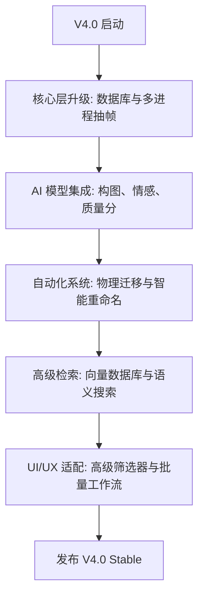

# AI Video Organizer v4.0: Mega Upgrade Technical Specification

## 1. 概述
V4.0 版本是本系统的重大里程碑，旨在通过深度结合多模态 AI 模型（如 Gemini 2.0 Pro, GPT-4o, CLIP 等），实现从“被动整理”到“主动智能资产管理”的跨越。核心聚焦于高维度的视频理解、自动化的物理资产组织以及极致的系统响应性能。

---

## 2. 20+ AI 增强功能设计 (AI-Driven Features)

### 2.1 深度内容理解 (High-Level Analysis)
1.  **情感与氛围多维分析**: 识别视频的情感基调（欢快、沉重、科幻、史诗、温馨、紧张）。
2.  **摄影构图自动识别**: 识别摄影专业标签（特写、中景、全景、航拍、黄金分割、对称构图、对角线构图）。
3.  **高级人物属性提取**: 识别性别、大致年龄段、服装风格（正装、休闲、运动）。
4.  **精细化动作检测**: 识别特定动作（奔跑、握手、微笑、思考、展示产品、驾驶、步行）。
5.  **光影与环境评估**: 识别光照条件（侧光、逆光、柔光、硬光）及环境（室内、室外、夜间、日间）。
6.  **色调与调色风格识别**: 识别色彩倾向（冷调、暖调、高饱和、低调、复古、赛博朋克）。
7.  **文字内容深度 OCR**: 提取画面中的所有文字（标题、路牌、屏幕文字），并进行上下文关联。

### 2.2 自动化与交互增强 (Automation & Interaction)
8.  **中英双语标签同步**: AI 自动翻译生成的标签，支持用户使用中英双语进行搜索。
9.  **标签智能联想**: 输入“大海”时，AI 自动推荐“沙滩”、“夏季”、“波浪”、“旅行”等相关标签。
10. **逻辑冲突检测**: AI 自动标记标签矛盾（如同时标记“航拍”和“室内”且无显著转场）。
11. **自动视频质量评级**: 根据模糊度、噪点、抖动程度、曝光度，自动打 1-5 星。
12. **智能重命名引擎 (V2)**: 基于 LLM 生成极具描述性的、SEO 友好的文件名，包含核心动作和氛围。
13. **素材查重与近似发现**: 利用 pHash + CLIP 向量发现视觉上极度相似的素材，建议清理。

### 2.3 专业剪辑流支持 (Pro-Workflow)
14. **代理剪辑智能建议**: 识别 H.265 (HEVC) / 4K+ / 高码率素材，自动标记“建议生成代理”。
15. **镜头语言描述生成**: 自动为每一段视频生成一段符合剪辑师逻辑的“场记描述”。
16. **自动分场建议**: 基于 Scene Detection，为长视频自动生成分场标志（Marker）。
17. **人脸聚类与角色识别**: 跨视频识别同一人物，支持“按角色筛选”。
18. **关键帧自动封面选择**: AI 选择最具表现力（美学分最高）的帧作为视频缩略图。
19. **音视频同步状态检查**: 检测是否有明显的音画不同步或静音片段。
20. **法律合规性预检**: 识别画面中可能存在的侵权标志、车牌或人脸，建议模糊处理。

---

## 3. 20+ 系统优化设计 (System Optimizations)

### 3.1 极致性能与存储 (Performance & Storage)
1.  **三级缓存架构**: L1 (内存 LRU 缓存), L2 (SQLite 本地缓存), L3 (持久化 JSON 备份)。
2.  **增量 AI 重新分析**: 仅对文件修改时间或哈希发生变化的片段进行重分析，避免重复支出。
3.  **多进程并行抽帧 (GPU 加速)**: 利用硬件加速解码器（NVDEC/VAAPI）进行极速抽帧。
4.  **批量处理优先级队列**: 支持手动触发的任务插队，后台扫描任务自动让速。
5.  **WebP 2.0 缩略图优化**: 使用 WebP 进行极致压缩，支持在不损失画质的情况下减少 60% 磁盘占用。
6.  **SQLite WAL2 模式**: 利用最新的 WAL2 模式（如果环境支持）提高极端并发下的读写性能。
7.  **内存映射文件 (mmap)**: 在加载大型索引时使用 mmap 减少 I/O 延迟。
8.  **数据库分片 (Sharding)**: 按年份或项目自动拆分数据库，维持单库性能。

### 3.2 搜索与检索 (Search & Retrieval)
9.  **FTS5 全文检索优化**: 针对中文进行分词优化，支持关键词高亮和模糊匹配。
10. **向量索引集成 (FAISS/Chroma)**: 支持自然语言描述搜索（“寻找阳光下的草地”），而不仅是标签匹配。
11. **搜索结果懒加载 (Windowing)**: UI 列表仅渲染可视区域，支持百万级素材滚动。
12. **预取逻辑 (Smart Prefetching)**: 根据用户悬停或滚动方向，提前解析并缓存下一组素材的元数据。

### 3.3 稳定性与安全 (Reliability & Security)
13. **原子化文件迁移**: 物理移动文件时采用“复制+校验+删除”机制，防止断电丢失。
14. **重命名回滚事务**: 记录完整的重命名链条，支持一键撤销多次重命名操作。
15. **API 请求熔断机制**: 当 API 服务端异常或余额不足时自动停止，避免界面卡死。
16. **自动数据修复**: 定期检查数据库路径与物理文件的一致性，自动重连移动后的文件。
17. **后台心跳监控**: 监控分析进程状态，崩溃后自动重启并接续任务。
18. **磁盘空间预警**: 在执行物理迁移或代理生成前，预计算磁盘剩余空间。
19. **多线程安全锁优化**: 细化数据库锁粒度，减少写入时的等待时间。
20. **日志自动轮转与压缩**: 保持精简的系统日志，防止长期运行撑爆磁盘。

---

## 4. 数据库表结构扩展方案 (DB Schema Extension)

### 4.1 视频主表 (videos) 扩展
```sql
ALTER TABLE videos ADD COLUMN emotion TEXT; -- 情感/氛围
ALTER TABLE videos ADD COLUMN composition TEXT; -- 构图标签
ALTER TABLE videos ADD COLUMN rating INTEGER DEFAULT 0; -- 1-5 星级
ALTER TABLE videos ADD COLUMN quality_score FLOAT; -- AI 计算的美学/质量分
ALTER TABLE videos ADD COLUMN is_proxy_needed INTEGER DEFAULT 0; -- 是否建议代理
ALTER TABLE videos ADD COLUMN proxy_path TEXT; -- 代理文件路径
ALTER TABLE videos ADD COLUMN face_clusters TEXT; -- 人脸聚类 ID (JSON 列表)
ALTER TABLE videos ADD COLUMN vector_id TEXT; -- 关联向量数据库的 ID
```

### 4.2 新增：标签关联表 (tag_associations)
```sql
CREATE TABLE tag_associations (
    tag_a TEXT,
    tag_b TEXT,
    weight FLOAT, -- 关联强度
    source TEXT -- 'ai' or 'manual'
);
```

### 4.3 新增：物理迁移日志表 (migration_history)
```sql
CREATE TABLE migration_history (
    id INTEGER PRIMARY KEY AUTOINCREMENT,
    old_path TEXT,
    new_path TEXT,
    reason TEXT, -- 如 'Auto-categorization'
    timestamp DATETIME DEFAULT CURRENT_TIMESTAMP
);
```

---

## 5. 核心 Service 接口更新规划 (Service API Updates)

### 5.1 增强型分析接口
```python
def analyze_video_v4(self, video_path: str, force: bool = False) -> Dict:
    # 1. 检查增量分析逻辑
    # 2. 并行执行：抽帧、音频转录、构图识别、情感分析
    # 3. 计算质量分与代理建议
    # 4. 存入向量数据库
    pass
```

### 5.2 物理组织接口
```python
def suggest_physical_move(self, video_id: int) -> str:
    # 根据 category 和 tags 返回建议的物理存放目录
    pass

def execute_batch_migration(self, moves: List[Dict]):
    # 执行原子化移动并记录日志
    pass
```

### 5.3 智能检索接口
```python
def smart_search(self, query: str, use_vector: bool = True) -> List[Dict]:
    # 结合 FTS5 文本匹配和 Vector 语义搜索
    pass
```

---

## 6. 路线图 (Roadmap)



---
设计者: Kilo Code
日期: 2026-02-11
