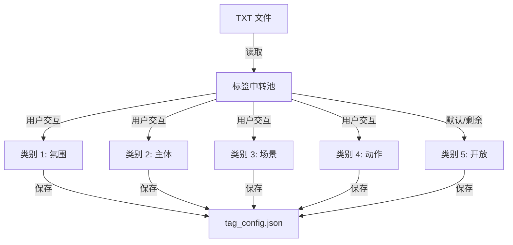

# 下一代 AI 视频标签分类与工作流规范 (v5.0)

## 1. 概述
本方案旨在通过引入严格的 5 分类标签体系、自定义标签库管理以及全自动化的 XMP 同步流程，提升视频素材管理的专业度与工作流效率。

## 2. 核心架构设计

### 2.1 标签五分类体系 (5-Category System)
标签将被划分为五个维度，其中前四个维度具有**互斥性**（每个维度仅允许一个标签），第五个维度为**开放性**。

| 类别 | 属性 | 约束 | 示例标签 |
| :--- | :--- | :--- | :--- |
| **C1: 氛围 (Mood)** | 互斥 | 1个 (预设库) | 唯美, 紧张, 治愈, 震撼 |
| **C2: 主体 (Subject)** | 互斥 | 1个 (预设库) | 人物, 建筑, 动物, 细节 |
| **C3: 场景 (Location)**| 互斥 | 1个 (预设库) | 室内, 户外, 城市, 自然 |
| **C4: 动作 (Action)** | 互斥 | 1个 (预设库) | 谈话, 奔跑, 静止, 办公 |
| **C5: 建议 (Custom)** | 开放 | 多个 (AI 自由发挥) | 红色, 逆光, 索尼 A7S3 |

### 2.2 数据持久化 (`tag_config.json`)
标签配置将独立于 `settings.json` 存储，便于用户快速备份与分享标签方案。

```json
{
  "version": "2.0",
  "config": [
    {
      "id": "mood",
      "display_name": "氛围",
      "exclusive": true,
      "tags": ["唯美", "治愈", "震撼", "科幻"]
    },
    ...
  ]
}
```

## 3. 标签库管理 UI 流程

### 3.1 导入与分配逻辑
1. **TXT 导入**: 支持一键读取 `.txt` 文件（每行一个标签）。
2. **可视化分配**:
   - 提供一个中转池（Unassigned Tags）。
   - 用户通过点击或拖拽，将标签分配至 C1-C4 的预设桶中。
   - 分配结果实时保存至 `tag_config.json`。



## 4. AI 分析逻辑更新 (`AIHandler`)

### 4.1 Prompt 结构优化
AI 的 System Prompt 将被注入用户自定义的标签库。要求 AI 必须遵守以下原则：
1. **库优先**: 在 C1-C4 维度中，必须且只能从提供的预设列表中选择最接近的一个。
2. **结构化输出**: 严格输出 JSON，区分预设维度与自由标签。

**Prompt 示例片段**:
> 请分析视频内容，并严格遵守以下规则：
> 1. 从【氛围】库 {mood_list} 中选 1 个。
> 2. 从【主体】库 {subject_list} 中选 1 个。
> ...
> 3. 在 'free_tags' 字段中补充 3 个画面细节标签。

## 5. XMP 工作流自动化

### 5.1 自动化触发机制
为了实现“静默同步”，系统将在以下节点自动执行 XMP 更新：
1. **分析完成**: `AnalysisWorker` 结束后，自动根据最新结果生成 `.xmp`。
2. **重命名后**: `RenameWorker` 成功后，自动移动/重命名对应的 `.xmp` 文件，并更新内部元数据（保持文件名与 XMP 内 reference 一致）。

### 5.2 XMP 元数据映射表
为了在 Adobe Premiere Pro 和 DaVinci Resolve 中获得最佳显示效果：

| XMP 字段 | 映射内容 | PR/达芬奇显示位置 |
| :--- | :--- | :--- |
| `dc:subject` | 所有标签 (C1+C2+C3+C4+C5) | 关键字 / Tags |
| `dc:description`| 50字核心摘要 | 描述 / Description |
| `xmp:Label` | 类别 1 (氛围) | 标签 / Label (颜色区分前提) |
| `lr:hierarchicalSubject` | 维度|标签 (如：场景|室内) | 层次化关键字 |

## 6. 实施路线图
1. **[核心]** 定义 `tag_config.json` 加载与保存逻辑。
2. **[AI]** 重构 `AIHandler` 的 JSON 解析与 Prompt 注入。
3. **[UI]** 实现 `TagsLibraryView` 的导入与分类分配界面。
4. **[工作流]** 在 `VideoOrganizerService` 中监听任务信号，实现 XMP 静默生成。
