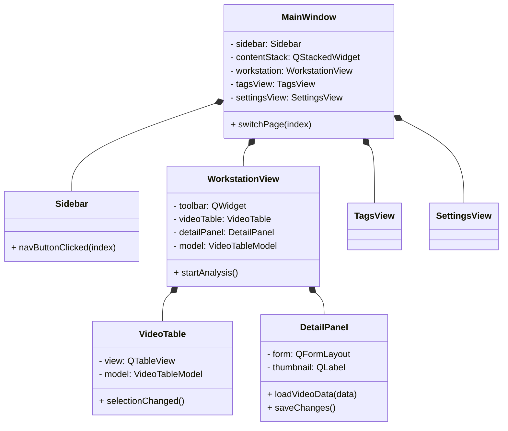
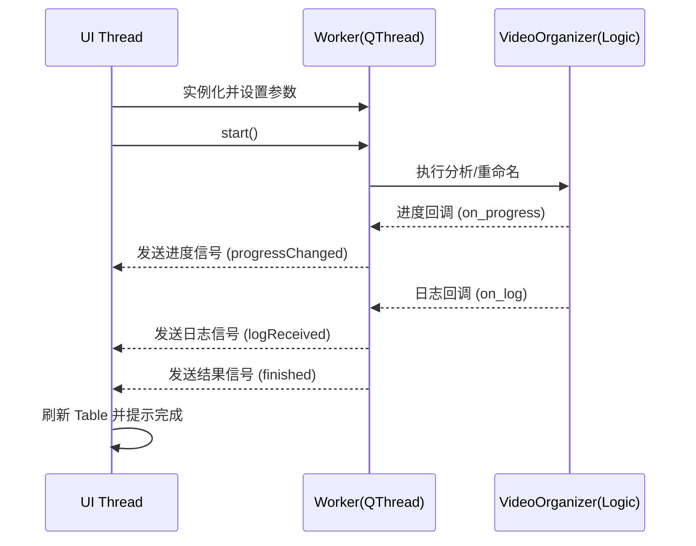

# PySide6 重构方案设计文档

## 1. 模块化架构设计

为了提高代码的可维护性和扩展性，我们将 UI 拆分为独立的组件，并通过信号/槽机制进行通信。

### 核心组件类图



### 关键组件职责
- **`MainWindow`**: 应用主窗口，管理整体布局和页面切换。
- **`Sidebar`**: 左侧导航栏，通过按钮点击触发页面切换信号。
- **`WorkstationView`**: 核心工作区，组合了工具栏、表格和详情面板。
- **`VideoTable`**: 封装 `QTableView`，负责数据展示、排序和多选。
- **`DetailPanel`**: 右侧详情页，提供缩略图预览和元数据编辑功能。

---

## 2. 数据模型 (Model/View)

使用 `QAbstractTableModel` 实现高效的数据绑定，减少 UI 刷新带来的开销。

### `VideoTableModel` 设计
- **数据源**: 直接对接 `DatabaseManager` 返回的列表。
- **列定义**: `选择`, `文件名`, `分类`, `标签`, `状态`, `去重`。
- **特殊处理**:
    - 第 0 列使用 `Qt.CheckStateRole` 实现复选框。
    - 状态列使用颜色标识（例如：XMP 状态用绿色显示）。
    - 支持异步加载缩略图（或使用缓存）。

---

## 3. 异步任务处理 (Worker Pattern)

使用 `QThread` 封装耗时操作，确保 UI 在分析、API 调用和重命名期间保持响应。

### 线程模型设计



### `Worker` 实现建议
- 创建 `AnalysisWorker(QThread)`: 负责扫描文件、抽帧和 AI 分析。
- 创建 `RenameWorker(QThread)`: 负责文件重命名和数据库更新。
- 使用信号发送进度百分比、当前状态消息和最终结果。

---

## 4. 主题与样式

为了实现现代化的深色模式，建议采用以下方案：

- **方案 A (推荐)**: 使用 `qt-material` 库。它提供了多种 Material Design 风格的主题，且易于集成。
    - 安装: `pip install qt-material`
    - 应用: `apply_stylesheet(app, theme='dark_teal.xml')`
- **方案 B**: 自定义 QSS。通过读取 `.qss` 文件加载自定义样式，灵活性最高。
- **方案 C**: 使用 `PySide6-Fluent-Widgets` (如果需要 Win11 风格)。

---

## 5. 依赖项清单

重构后需要安装的库：

```bash
# 核心 GUI 库
pip install PySide6

# 样式库 (选其一)
pip install qt-material

# 原有逻辑依赖
pip install openai opencv-python pillow scenedetect imagehash
```

---

## 6. 重构步骤

分阶段实施，确保每一步都可验证：

### 第一阶段: 基础架构搭建
1. 创建基础 `MainWindow` 和 `Sidebar`。
2. 实现 `QStackedWidget` 页面切换逻辑。
3. 创建空的 `WorkstationView`, `TagsView`, `SettingsView` 类。

### 第二阶段: 数据模型与表格
1. 实现 `VideoTableModel`。
2. 在 `WorkstationView` 中集成 `QTableView` 并绑定模型。
3. 实现从数据库加载数据并刷新的功能。

### 第三阶段: 异步任务集成
1. 封装 `AnalysisWorker`。
2. 实现工具栏中的“开始分析”按钮逻辑，绑定进度条和日志显示。
3. 封装 `RenameWorker`。

### 第四阶段: 详情面板与标签管理
1. 实现 `DetailPanel` 的数据回显和保存功能。
2. 完善 `TagsView` 的增删改查逻辑。
3. 实现 `SettingsView` 的配置持久化。

### 第五阶段: 主题与微调
1. 引入 `qt-material` 或自定义 QSS。
2. 优化高 DPI 支持。
3. 进行最终集成测试和 Bug 修复。

---
