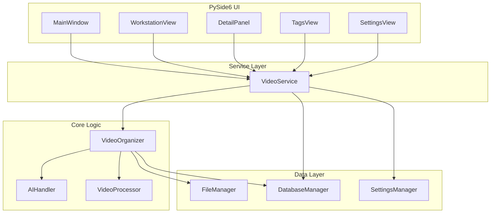

# Video Organizer Refactoring Plan

This plan outlines the steps to clean up obsolete files, decouple business logic from the UI, and modernize the architecture of the Video Organizer project.

## 1. Cleanup Phase
The following files have been identified as obsolete or redundant and will be removed:

*   **`video_organizer_gui.py`**: Legacy Tkinter/CustomTkinter GUI. Superseded by `video_organizer_pyside6.py`.
*   **`ai_video_classifier.py`**: Standalone script whose functionality is fully covered by `video_organizer.py`.
*   **`ai_tagger.py`**: Standalone tagging script. Its unique "Dynamic Tag Discovery" feature will be integrated into the core before deletion.
*   **`undo_rename.py`**: Auto-generated script. Can be safely deleted as the system now uses database-driven rollback.

## 2. Core Logic Enhancement (`video_organizer.py`)
We will enhance the core `VideoOrganizer` class and introduce a `VideoService` layer to handle business transactions.

### 2.1 Integrate "Dynamic Tag Discovery"
*   **Source**: `ai_tagger.py` (lines 124-128).
*   **Target**: `AIHandler.analyze_video` in `video_organizer.py`.
*   **Logic**: When the AI suggests a "Key Object" tag that isn't in the predefined list, it should be dynamically added to the `KeyObjects` dimension in `settings` (and persisted).

### 2.2 Create `VideoService` Layer
To decouple the UI from direct DB/Settings manipulation, we will implement a `VideoService` class (or expand `VideoOrganizer` to act as one).

**New Methods to Implement:**
*   `update_video_metadata(path, category, tags, summary, transcription)`: Handles updating a single video record.
*   `batch_update_videos(paths, category=None, tags_to_add=None, merge_tags=True)`: Handles batch updates with logic for merging tags.
*   `delete_videos(paths)`: Handles deleting video records from the DB.
*   `add_tag_to_library(dimension, tag_name)`: Adds a new tag to the settings/DB.
*   `remove_tag_from_library(dimension, tag_name)`: Removes a tag.
*   `rename_tag_globally(dimension, old_name, new_name)`: Renames a tag in the library *and* updates all video records that use this tag (replaces the "Merge Tag" logic currently in `gui.py`).
*   `get_all_tags()`: Returns the structured tag library.

## 3. UI Refactoring (`video_organizer_pyside6.py`)
The PySide6 application currently contains business logic that belongs in the Service layer.

### 3.1 `DetailPanel` Refactoring
*   **Current State**: Manually constructs update dicts and calls `db.upsert_video`. Handles "merge tags" logic locally.
*   **Refactoring**: 
    *   Inject `VideoService` instead of `DatabaseManager`.
    *   Replace `save_changes` logic with calls to `service.update_video_metadata` or `service.batch_update_videos`.

### 3.2 `TagsView` Refactoring
*   **Current State**: Modifies `settings` dict directly and calls `SettingsManager.save_settings`.
*   **Refactoring**:
    *   Use `service.add_tag_to_library`, `service.remove_tag_from_library`.
    *   **New Feature**: Add a "Rename/Merge Tag" button that uses `service.rename_tag_globally` (porting the logic from the old GUI).

### 3.3 `WorkstationView` Refactoring
*   **Current State**: Calls `db.delete_video` directly.
*   **Refactoring**: Use `service.delete_videos`.

### 3.4 `SettingsView` Refactoring
*   **Current State**: Modifies `settings` dict directly.
*   **Refactoring**: This is acceptable for simple settings, but ideally should use `SettingsManager` methods explicitly exposed via `VideoService`.

## 4. Execution Steps

1.  **Backup**: Ensure the current project is backed up.
2.  **Core Update**: 
    *   Modify `video_organizer.py` to include the `VideoService` class (or methods).
    *   Integrate dynamic tagging logic.
3.  **UI Update**:
    *   Modify `video_organizer_pyside6.py` to instantiate and use `VideoService`.
    *   Remove direct `db` calls in widgets.
4.  **Verification**:
    *   Run the application.
    *   Test single video editing (save works?).
    *   Test batch video editing (merge tags works?).
    *   Test tag management (add/delete/rename tags works?).
    *   Test analysis (dynamic tagging works?).
5.  **Cleanup**: Delete the obsolete files identified in Step 1.

## 5. Architecture Diagram

