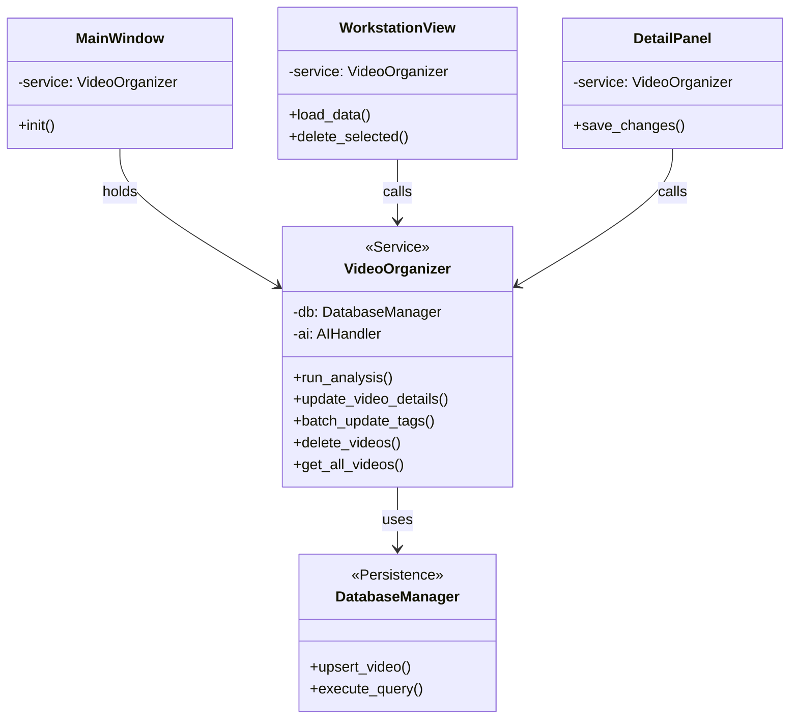

# 重构与清理计划：视频整理项目

## 1. 目标
本次重构旨在清理过时的 Python 脚本，消除代码冗余，并解耦 PySide6 UI 与底层数据库逻辑，构建一个清晰的 MVC 分层架构。

## 2. 现状分析

### 2.1 文件状态
| 文件名 | 状态 | 建议操作 | 说明 |
| :--- | :--- | :--- | :--- |
| `video_organizer_pyside6.py` | **活跃** | **重构** | 新版 UI 入口，需解耦业务逻辑。 |
| `video_organizer.py` | **核心** | **增强** | 核心逻辑库，需增强为 Service 层。 |
| `video_organizer_gui.py` | *过时* | 删除 | 旧版 CustomTkinter UI，已被 PySide6 取代。 |
| `ai_tagger.py` | *过时* | 合并后删除 | 独立标签生成脚本，功能需合并入核心。 |
| `ai_video_classifier.py` | *过时* | 删除 | 早期 AI 分类脚本，功能已在核心中。 |
| `video_renamer.py` | *过时* | 删除 | 独立重命名脚本，功能已在核心中。 |
| `undo_rename.py` | *临时* | 删除 | 自动生成的撤销脚本，核心已支持数据库级回滚。 |

### 2.2 逻辑耦合问题
目前 `video_organizer_pyside6.py` 存在以下耦合点：
*   **直接数据库访问**: `DetailPanel`, `WorkstationView`, `TagsView` 等组件直接实例化 `DatabaseManager` 并执行 SQL/CRUD 操作。
*   **业务逻辑分散**: 标签合并、数据校验等逻辑分散在 UI 事件处理函数中。
*   **功能缺失**: `video_organizer.py` 缺少 `ai_tagger.py` 中的“动态标签发现”特性（即 AI 发现新物品时自动扩充标签库）。

## 3. 重构执行步骤

### 第一阶段：核心逻辑增强 (Service Layer)

在 `video_organizer.py` 中进行以下修改：

1.  **合并动态标签发现逻辑**:
    *   修改 `AIHandler.analyze_video`，当 AI 返回新的“关键物品”标签时，将其记录下来。
    *   在 `SettingsManager` 或 `DatabaseManager` 中添加方法，用于持久化新发现的标签到数据库/设置中。

2.  **封装业务服务 (`VideoService` / 增强 `VideoOrganizer`)**:
    *   在 `VideoOrganizer` 类中添加面向 UI 的 CRUD 方法，屏蔽底层 DB 细节。
    *   **新增方法签名示例**:
        *   `get_video_list(filter_criteria=None) -> List[Dict]`
        *   `update_video_details(path, category, tags, summary, transcription) -> bool`
        *   `batch_update_tags(paths, new_tags, merge=True) -> int` (返回更新数量)
        *   `delete_videos(paths) -> bool`
        *   `get_all_tags() -> Dict[str, List[str]]`
        *   `add_new_tag(dimension, tag_name) -> bool`

### 第二阶段：UI 解耦 (Controller/View Layer)

在 `video_organizer_pyside6.py` 中进行以下修改：

1.  **替换依赖**:
    *   构造函数不再接收 `db_manager`，而是接收 `VideoOrganizer` (Service) 实例。
    *   移除所有 `import sqlite3` 或直接 SQL 执行的代码。

2.  **重构组件**:
    *   **`DetailPanel`**: `save_changes` 方法改为调用 `organizer.update_video_details` 或 `organizer.batch_update_tags`。
    *   **`WorkstationView`**: `load_data` 改为调用 `organizer.get_video_list`；`delete_selected` 改为调用 `organizer.delete_videos`。
    *   **`TagsView`**: 标签的增删改查全部通过 `organizer` 提供的接口进行。

3.  **统一入口**:
    *   `MainWindow` 初始化时创建单一的 `VideoOrganizer` 实例，并传递给所有子视图。

### 第三阶段：清理与收尾

1.  **验证功能**: 确保分析、重命名、标签管理、撤销等功能在重构后正常工作。
2.  **删除文件**: 删除列表中的“建议操作”为删除的文件。
3.  **重命名**: 将 `video_organizer_pyside6.py` 重命名为标准的入口名称（如 `main_gui.py` 或 `app.py`），或者直接覆盖 `video_organizer_gui.py`（不推荐，最好用新名字）。

## 4. 架构图 (Mermaid)

## 5. 待办事项 (Todo List)

- [ ] 修改 `video_organizer.py`: 实现动态标签发现与持久化。
- [ ] 修改 `video_organizer.py`: 添加 CRUD 封装方法到 `VideoOrganizer` 类。
- [ ] 修改 `video_organizer_pyside6.py`: 替换 DB 调用为 Service 调用。
- [ ] 测试 GUI 功能。
- [ ] 删除 `video_organizer_gui.py`, `ai_tagger.py`, `ai_video_classifier.py`, `video_renamer.py`, `undo_rename.py`。
