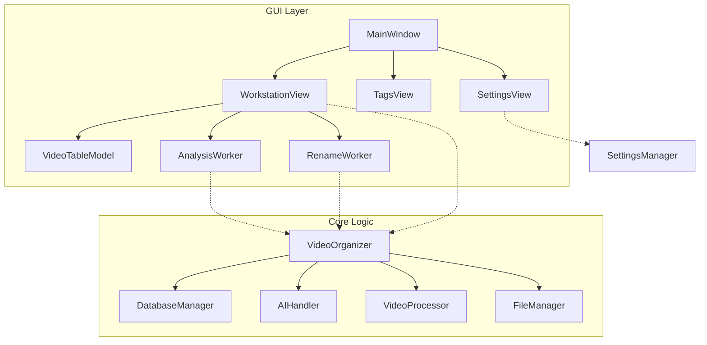

# 视频整理工具重构计划 (Refactoring Plan)

## 1. 现状分析
当前项目包含多个版本的 GUI 实现和多个独立的辅助脚本，导致代码冗余、维护困难且逻辑分散。核心业务逻辑虽然在 `video_organizer.py` 中有初步封装，但 GUI 层 (`video_organizer_pyside6.py`) 仍然包含了大量直接的数据库操作和业务逻辑，违反了关注点分离原则。

## 2. 重构目标
1.  **清理过时代码**: 移除旧版 GUI 和独立的辅助脚本。
2.  **统一核心逻辑**: 将所有业务逻辑（标签生成、重命名、数据库操作）集中到 `video_organizer.py` 中，使其成为唯一的 Service 层。
3.  **解耦 UI 与逻辑**: GUI 只负责展示和用户交互，所有数据操作通过 `VideoOrganizer` 类进行。
4.  **模块化 GUI**: 将单文件 `video_organizer_pyside6.py` 拆分为清晰的包结构。

## 3. 废弃文件清单
以下文件将被删除或归档：
*   `video_organizer_gui.py`: 旧版 tkinter GUI，功能已被 PySide6 版本取代。
*   `ai_tagger.py`: 独立标签生成脚本。功能需合并入 `video_organizer.py` 的 `AIHandler`。
*   `ai_video_classifier.py`: 独立分类脚本。功能已在 `video_organizer.py` 中。
*   `video_renamer.py`: 独立重命名脚本。功能需合并入 `video_organizer.py`。
*   `undo_rename.py`: 自动生成的撤销脚本。将被数据库驱动的回滚机制取代。

## 4. 新架构设计

### 4.1 核心层 (`video_organizer.py`)
`VideoOrganizer` 类将升级为主要的服务入口 (Facade)，提供以下高级 API：
*   `scan_and_analyze(path, options)`: 扫描并分析视频。
*   `get_all_videos(filter_params)`: 获取视频列表（支持筛选）。
*   `update_video_metadata(path, new_data)`: 更新视频信息（合并 `ai_tagger` 的动态标签发现逻辑）。
*   `batch_rename(paths, dry_run)`: 执行重命名。
*   `rollback_last_session()`: 回滚重命名。
*   `delete_videos(paths)`: 删除视频记录。
*   `export_data(format, path)`: 导出数据。

### 4.2 GUI 层结构 (`gui/`)
```
gui/
├── __init__.py
├── main.py              # 程序入口，组装 MainWindow
├── styles.py            # QSS 样式定义
├── widgets/             # 通用组件
│   ├── __init__.py
│   ├── tag_flow.py      # TagFlowWidget, TagChip
│   ├── filter_panel.py  # FilterPanel
│   └── detail_panel.py  # DetailPanel
├── views/               # 主要视图
│   ├── __init__.py
│   ├── workstation.py   # WorkstationView
│   ├── tags_library.py  # TagsView
│   └── settings.py      # SettingsView
├── models/              # 数据模型
│   ├── __init__.py
│   ├── video_table.py   # VideoTableModel
│   └── proxy_model.py   # AdvancedSortFilterProxyModel
└── workers/             # 异步任务
    ├── __init__.py
    ├── analysis_worker.py
    └── rename_worker.py
```

### 4.3 依赖关系图 (Mermaid)



## 5. 分步实施计划

### 第一阶段：清理与逻辑整合
1.  **备份**: 将当前所有 `.py` 文件备份到 `backups/pre_refactor/`。
2.  **增强 Core**:
    *   在 `AIHandler` 中实现 `ai_tagger.py` 的“动态标签发现”逻辑（即：如果 AI 返回了新标签，自动添加到标签库）。
    *   在 `VideoOrganizer` 中添加 `update_video(path, data)` 方法，封装 `db.upsert_video`。
    *   在 `VideoOrganizer` 中添加 `delete_videos(paths)` 方法。
3.  **移除脚本**: 删除废弃文件清单中的文件。

### 第二阶段：GUI 模块化拆分
1.  **创建目录**: 创建 `gui/` 及其子目录。
2.  **提取组件**:
    *   将 `TagFlowWidget`, `TagChip`, `FlowLayout` 提取到 `gui/widgets/tag_flow.py`。
    *   将 `FilterPanel`, `CheckableComboBox` 提取到 `gui/widgets/filter_panel.py`。
    *   将 `DetailPanel` 提取到 `gui/widgets/detail_panel.py`。
3.  **提取模型**:
    *   将 `VideoTableModel`, `ThumbnailLoader` 提取到 `gui/models/video_table.py`。
    *   将 `AdvancedSortFilterProxyModel` 提取到 `gui/models/proxy_model.py`。
4.  **提取视图**:
    *   将 `WorkstationView` 提取到 `gui/views/workstation.py`。
    *   将 `TagsView` 提取到 `gui/views/tags_library.py`。
    *   将 `SettingsView` 提取到 `gui/views/settings.py`。
5.  **提取 Workers**:
    *   将 `AnalysisWorker`, `RenameWorker` 提取到 `gui/workers/`。

### 第三阶段：解耦与重组
1.  **更新引用**: 确保所有新模块正确导入 `video_organizer` 中的类。
2.  **移除直接 DB 访问**:
    *   修改 `DetailPanel`，不再持有 `db_manager`，而是通过信号 `save_requested(data)` 通知上层，或持有 `VideoOrganizer` 实例。
    *   修改 `WorkstationView`，使用 `VideoOrganizer` 的方法替代 `self.db.delete_video` 等调用。
    *   修改 `TagsView` 和 `SettingsView` 同理。
3.  **组装 Main**: 创建 `gui/main.py`，初始化 `VideoOrganizer` 并传递给 `MainWindow`。
4.  **入口脚本**: 创建项目根目录下的 `main.py` 或更新 `video_organizer.py` 的 `main` 函数以启动新 GUI。

### 第四阶段：验证
1.  运行新入口，检查所有功能（分析、筛选、编辑、重命名、设置）是否正常。
2.  验证“动态标签发现”功能是否在 GUI 中生效。
