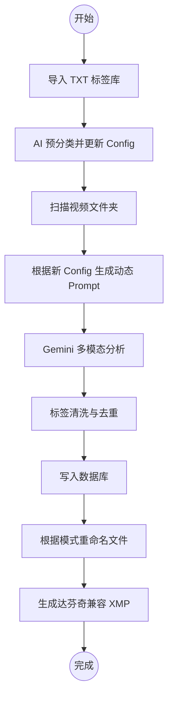

# AI 标签系统升级与 XMP 功能改进技术规格书 (v5.0)

## 1. 概述
本方案旨在通过引入动态标签配置、AI 自动分类和深度兼容达芬奇 (DaVinci Resolve) 的 XMP 元数据支持，提升视频素材管理的自动化程度和跨软件协作能力。

## 2. 标签系统升级

### 2.1 标签导入与 AI 预分类
- **功能描述**：支持用户导入外部标签库（TXT 格式，每行一个），并利用 AI 将其自动归类到现有的维度中。
- **AI 分类逻辑**：
  - **输入**：用户导入的原始标签列表 + 当前 `tag_config.json` 中的分类定义（ID 和描述）。
  - **Prompt 策略**：要求 AI 分析标签语义，将其映射到最相关的分类 ID。若语义模糊，则归入 `custom` 或 `other`。
  - **输出格式**：`{"标签名": "分类ID"}`。

### 2.2 `tag_config.json` 结构更新
版本升级至 `5.0`，增加分类级的控制逻辑：
```json
{
  "version": "5.0",
  "config": [
    {
      "id": "mood",
      "display_name": "氛围 (C1)",
      "exclusive": true,
      "max_count": 1,
      "ai_expandable": false,
      "description": "视频的视觉风格与情感基调",
      "tags": ["唯美", "治愈", "震撼", "悬疑"]
    },
    {
      "id": "custom",
      "display_name": "建议 (C5)",
      "exclusive": false,
      "max_count": 5,
      "ai_expandable": true,
      "description": "自由发挥的细节描述",
      "tags": []
    }
  ]
}
```

## 3. 视频识别逻辑优化

### 3.1 动态 Prompt 生成
`AIHandler` 将不再使用硬编码的 Prompt，而是根据 `tag_config.json` 实时构造：
- **约束生成**：
  - 如果 `ai_expandable` 为 `false`：加入指令 “必须且只能从预设库中选择”。
  - 根据 `max_count`：加入指令 “选择不超过 X 个”。
  - 加入分类描述 `description` 以提高 AI 理解准确度。

### 3.2 识别输出处理
- AI 返回的 JSON 将直接对应 `tag_config.json` 中的 `id`。
- 系统自动对 AI 补充的新标签（当 `ai_expandable` 为 `true` 时）进行持久化建议。

## 4. 达芬奇 (DaVinci Resolve) XMP 兼容性方案

### 4.1 元数据字段设计
为了确保在达芬奇和 Premiere Pro 中都能完美显示标签和描述，XMP 将包含以下命名空间：

| 字段 | 命名空间 | 用途 | 达芬奇对应位置 |
| :--- | :--- | :--- | :--- |
| **关键字** | `dc:subject` | 扁平化标签列表 | 媒体池 - Keywords |
| **层级标签** | `lr:hierarchicalSubject` | `分类|标签` 格式 | 智能素材箱/元数据 |
| **标题/描述** | `dc:description` | 视频内容摘要 | 媒体池 - Description |
| **分级** | `xmp:Rating` | 1-5 星级 | 媒体池 - Rating |
| **标签颜色** | `xmp:Label` | 氛围标签 | 媒体池 - Usage (部分支持) |

### 4.2 XMP 结构示例
```xml
<x:xmpmeta xmlns:x="adobe:ns:meta/">
 <rdf:RDF xmlns:rdf="http://www.w3.org/1999/02/22-rdf-syntax-ns#">
  <rdf:Description rdf:about=""
    xmlns:dc="http://purl.org/dc/elements/1.1/"
    xmlns:xmp="http://ns.adobe.com/xap/1.0/"
    xmlns:lr="http://ns.adobe.com/lightroom/1.0/">
   <dc:description>
    <rdf:Alt><rdf:li xml:lang="x-default">这里是 AI 生成的摘要内容</rdf:li></rdf:Alt>
   </dc:description>
   <dc:subject>
    <rdf:Bag>
     <rdf:li>治愈</rdf:li>
     <rdf:li>人物|男性</rdf:li>
    </rdf:Bag>
   </dc:subject>
   <lr:hierarchicalSubject>
    <rdf:Bag>
     <rdf:li>氛围|治愈</rdf:li>
     <rdf:li>主体|人物|男性</rdf:li>
    </rdf:Bag>
   </lr:hierarchicalSubject>
   <xmp:Rating>5</xmp:Rating>
  </rdf:Description>
 </rdf:RDF>
</x:xmpmeta>
```

## 5. 新工作流整合

### 5.1 完整处理流程


### 5.2 错误处理机制
- **API 失败兜底**：若 AI 无法按库选择，系统将尝试使用编辑距离算法 (Levenshtein) 进行最接近匹配。
- **XMP 冲突处理**：如果已存在 XMP，系统将执行增量合并而非覆盖（可选）。

## 6. 实施计划
1. 修改 `tag_config.json` 模板。
2. 在 `core/video_organizer_service.py` 中重构 `AIHandler._get_api_response` 的 Prompt 构造逻辑。
3. 更新 `VideoOrganizerService.sync_metadata_to_xmp` 以支持多命名空间输出。
4. 在 GUI 层添加标签导入按钮。
