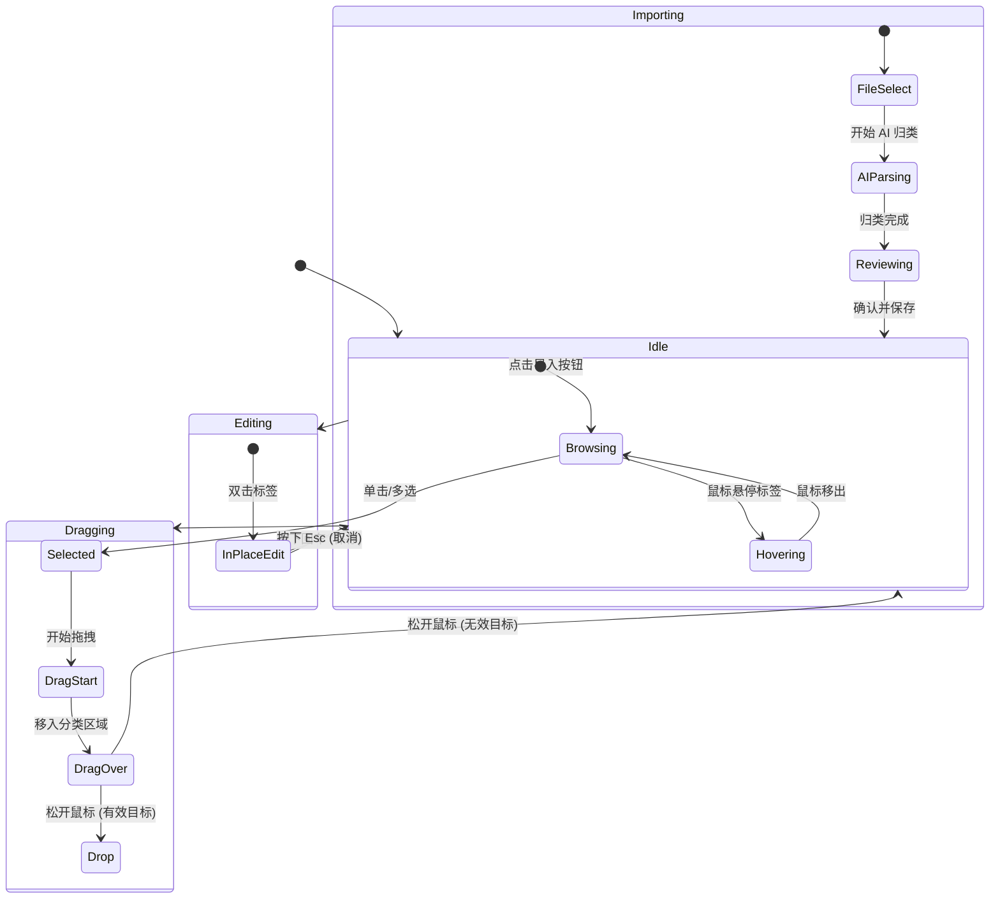

# 标签库 (Tags Library) V2 重新设计方案

## 1. 背景与目标
当前的标签库界面采用传统的 `QListWidget` 列表形式，交互单一且视觉表现力不足。本次重新设计旨在打造一个**现代化、交互友好、高性能**的标签管理系统。

### 设计核心目标：
*   **可视化分栏布局**：清晰展示标签流动方向。
*   **流式交互**：支持丝滑的拖拽、批量操作与原地编辑。
*   **智能化导入**：增强 TXT 导入过程的透明度与可控性。
*   **大数据量优化**：支持数千个标签的流畅滚动与过滤。

---

## 2. UI 布局草图 (Markdown 描述)

```text
+-----------------------------------------------------------------------+
|  [ 标签库管理 ]                                      [ 导入 TXT ] [ 保存 ] |
+-----------------------------------------------------------------------+
|  +------------+  +------------+  +------------+  +------------+  +------------+
|  | 中转池 (All) |  | C1: 氛围    |  | C2: 主体    |  | C3: 场景    |  | ...        |
|  | [搜索标签...] |  | [属性配置]  |  | [属性配置]  |  | [属性配置]  |  |            |
|  +------------+  +------------+  +------------+  +------------+  +------------+
|  | # 标签1 [x] |  | # 浪漫 [x] |  | # 森林 [x] |  | # 室内 [x] |  |            |
|  | # 标签2 [x] |  | # 悬疑 [x] |  |            |  |            |  |            |
|  | # 标签3 [x] |  |            |  |            |  |            |  |            |
|  | ...        |  |            |  |            |  |            |  |            |
|  +------------+  +------------+  +------------+  +------------+  +------------+
|  | [+ 快速添加] |  | [+ 快速添加] |  | [+ 快速添加] |  | [+ 快速添加] |  |            |
|  +------------+  +------------+  +------------+  +------------+  +------------+
+-----------------------------------------------------------------------+
```

### 关键组件设计：
*   **TagBoard**: 顶层容器，采用 `QHBoxLayout` 或 `QScrollArea` 包裹的水平布局。
*   **CategoryColumn**: 单个分类卡片。
    *   **Header**: 包含分类名称（C1-C5）、标签总数、配置图标（弹出设置：互斥性、最大数量、AI 自动扩展）。
    *   **Content**: 增强型 `QListView`，配合 `TagChipDelegate` 实现气泡样式。
    *   **Footer**: 紧凑的 `QLineEdit` 用于快速向该分类添加标签。
*   **TagChip (Delegate)**: 
    *   绘制圆角矩形背景。
    *   悬停时显示删除按钮 (×)。
    *   双击进入编辑模式。

---

## 3. 核心交互逻辑

### 3.1 拖拽重分类 (Drag & Drop)
*   **源**: 选中的一个或多个标签气泡。
*   **反馈**: 拖拽时显示半透明的标签缩略图和数量标识（如 "移动 3 个标签"）。
*   **目标**: 目标分类列高亮（边框变色或背景变暗）。
*   **逻辑**: 移动操作，从源分类移除并添加至目标分类。

### 3.2 批量操作
*   **选择**: 支持 Ctrl+点击（多选）、Shift+点击（连选）、矩形框选（需在 `QListView` 中实现）。
*   **右键菜单**: 提供“移动至...”、“批量删除”、“导出选中”等选项。

### 3.3 导入流程优化 (Wizard)
1.  **解析页**: 读取 TXT，展示去重后的标签列表。
2.  **AI 分类页**:
    *   显示环形进度条。
    *   实时滚动显示“正在分析标签：[XXX]...”。
3.  **结果校对页**: 
    *   采用分栏预览模式展示 AI 的建议归类。
    *   用户可在此界面直接拖拽调整，满意后点击“确认导入”。

---

## 4. 交互状态机 (Mermaid)



---

## 5. 技术实现与性能优化

### 5.1 需要新增/重构的 PySide6 组件
*   **`TagListView(QListView)`**: 核心视图类。启用 `ExtendedSelection`。
*   **`TagModel(QAbstractListModel)`**: 强类型数据模型，支持高效的增删改查及 MIME 数据处理（用于拖拽）。
*   **`TagChipDelegate(QStyledItemDelegate)`**: 负责高性能绘制标签样式，处理鼠标点击事件（如点击删除图标）。
*   **`ImportWizardDialog(QDialog)`**: 包含 `QStackedWidget` 实现多步导入流程。

### 5.2 性能策略 (针对海量标签)
1.  **Model/View 架构**: 彻底弃用 `QListWidget`。`QListView` 只渲染可见区域，可轻松处理 10,000+ 标签。
2.  **异步 AI 调用**: 使用 `QThread` 或 `QRunnable` 处理 AI 分类逻辑，避免界面卡死。
3.  **流式布局模拟**: 虽然 `QListView` 通常是网格或列表，可以通过自定义 `isWrapping` 属性和 `Flow` 模式实现类似 `TagFlow` 的视觉效果，同时保持模型视图的性能优势。

---

## 6. 后续计划
1.  [ ] 实现 `TagModel` 与 `TagChipDelegate` 原型。
2.  [ ] 重构 `TagsView` 的 UI 布局为多栏模式。
3.  [ ] 实现跨列拖拽逻辑。
4.  [ ] 开发导入向导对话框。
