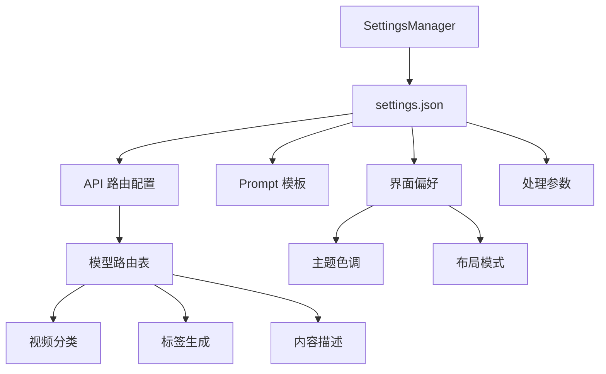

# UI 视觉重构与高级设置系统规格书 (V3)

## 1. 设计理念 (Design Philosophy)
本次重构的核心目标是**“护眼、沉浸、直观”**。通过降低色彩饱和度、增加暖色调比例以及优化空间层次感，为长时间处理视频素材的用户提供更舒适的工作环境。

## 2. 视觉方案 (Visual Specification)

### 2.1 核心调色板 (Core Palette)
| 用途 | 颜色名称 | HEX 代码 | 视觉效果 |
| :--- | :--- | :--- | :--- |
| **主背景** | 深炭黑 | `#1e1e1e` | 核心工作区背景，降低发光感 |
| **侧边栏/标题栏** | 暖深灰 | `#252526` | 区分功能区，略显柔和 |
| **组件表面** | 灰石色 | `#2d2d2d` | 表格、分组框、输入框背景 |
| **主文字** | 柔和灰白 | `#d4d4d4` | 降低文字对比度，减少眼部疲劳 |
| **副文字** | 雾灰色 | `#808080` | 用于注释和非活跃状态 |
| **主点缀色** | 琥珀金 | `#ce9178` | 按钮、选中状态，暖色调引导 |
| **副点缀色** | 莫兰迪蓝 | `#569cd6` | 链接、进度条，低饱和度 |
| **边框线** | 中性灰 | `#3e3e42` | 细腻的分隔感 |

### 2.2 关键组件样式建议
- **侧边栏**: 移除原有的蓝紫色渐变，改为纯色 `#252526` 或极简垂直线分隔。
- **按钮**: 主按钮使用琥珀色背景 (`#ce9178`)，白字。悬停时略微加亮。
- **表格**: 行高增加，去除鲜艳的蓝色选中背景，改为透明度较低的琥珀色半透明遮罩。

---

## 3. 设置系统架构 (Settings Architecture)

### 3.1 `settings.json` 扩展结构
我们将从扁平结构升级为层级结构，支持更细粒度的控制：

```json
{
  "api": {
    "key": "sk-...",
    "base_url": "https://api.example.com/v1",
    "model_personalization": {
      "video_classification": "gpt-4o",
      "tag_generation": "claude-3.5-sonnet",
      "content_description": "gemini-1.5-pro",
      "audio_whisper": "whisper-1"
    }
  },
  "prompts": {
    "video_classification": "你是一个视频分类专家，请根据...",
    "tag_generation": "请为以下视频生成5-10个标签...",
    "content_description": "详细描述视频画面中的元素、动作..."
  },
  "ui_preferences": {
    "theme": "eye_friendly_dark",
    "font_size": 14,
    "thumbnail_size": [160, 90],
    "compact_mode": false,
    "show_grid_lines": true
  },
  "processing": {
    "max_workers": 4,
    "max_frames": 10,
    "jpeg_quality": 85,
    "enable_scene_detection": true,
    "enable_audio_transcription": false
  }
}
```

---

## 4. 设置界面 UI 布局规划 (`gui/views/settings.py`)

建议引入 `QTabWidget` (选项卡) 来组织扩展后的选项：

### Tab 1: 基础设置 (General)
- **处理配置**: 并发线程数、最大抽帧数、JPEG 质量。
- **重命名规则**: 现有的重命名模式字符串输入及变量说明。

### Tab 2: AI 模型 (AI Models)
- **API 通用**: API Key (密码模式)、Base URL。
- **模型路由**:
    - 下拉框：视频分类模型
    - 下拉框：标签生成模型
    - 下拉框：内容描述模型
- *注：右侧可放置一个“测试连接”按钮。*

### Tab 3: Prompt 管理 (Prompts)
- 垂直排列的多个 `QPlainTextEdit`。
- 每个编辑器上方有标题（如“分类任务 Prompt”）。
- **功能点**: 底部提供“恢复默认值”按钮。

### Tab 4: 界面偏好 (UI)
- **字体**: 字体大小调节（SpinBox）。
- **预览图**: 缩略图宽度/高度调节。
- **显示**: 紧凑模式开关、网格线开关。
- **颜色**: 主题色预设切换（未来扩展）。

## 6. 系统架构图 (Architecture Diagram)



---

## 7. 总结 (Summary)
本次设计旨在将应用从“功能型工具”提升为“专业级工作站”。通过分层设置结构，用户可以针对不同任务利用不同模型的优势（如利用 GPT-4o 的逻辑进行分类，利用 Claude-3.5 的文学性进行描述）；而视觉上的调整则确保了高强度的使用下依然拥有良好的感官体验。
>>>>>>> REPLACE

