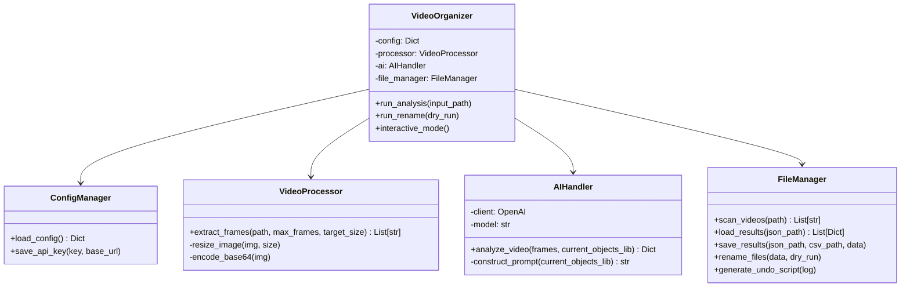

# Unified AI Video Organizer - Technical Specification

## 1. Overview
This project consolidates three existing Python scripts (`ai_video_classifier.py`, `ai_tagger.py`, `video_renamer.py`) into a single, optimized solution named `video_organizer.py`.

**Key Improvements:**
*   **Single-Pass AI Processing:** Combines Classification, Summarization, and Tagging into a single API call, reducing costs and processing time by ~50%.
*   **Unified Architecture:** Eliminates code duplication (Config, API handling, File I/O).
*   **Streamlined Workflow:** A single command to Scan -> Analyze -> Rename (optional).
*   **Enhanced Robustness:** Centralized error handling, retry logic, and undo capabilities.

## 2. Architecture Design

### 2.1 Class Structure

### 2.2 Data Flow

1.  **Initialization**: Load `.env` via `ConfigManager`.
2.  **Discovery**: `FileManager` scans the directory for video files.
3.  **Filtering**: Compare found videos against existing `video_analysis_results.json` to skip processed files.
4.  **Processing Loop (Multithreaded)**:
    *   `VideoProcessor` extracts 10 frames (resized to 512px).
    *   `AIHandler` sends frames to LLM (Gemini/OpenAI).
    *   **Unified Prompt** requests JSON with: `{category, summary, tags: [5 items]}`.
    *   `FileManager` saves result to JSON/CSV immediately (thread-safe).
5.  **Renaming (Optional Step)**:
    *   Read enriched results.
    *   Generate new filename: `Category-Tag1_Tag2...-Summary-OriginalSuffix`.
    *   Perform Rename & Generate Undo Script.

## 3. Optimized Prompt Design (The "Secret Sauce")

Instead of two separate calls, we use one multimodal prompt.

**System Prompt:**
> You are an expert video content classifier and tagger. Analyze the provided video frames to extract structured metadata.

**User Prompt:**
> Analyze these video frames and provide a JSON response with the following fields:
> 1.  **category**: Choose exactly one from [List: Aroll, Broll, Vlog, ...].
> 2.  **summary**: A concise summary (max 50 words).
> 3.  **tags**: A list of exactly 5 tags corresponding to these dimensions:
>     *   Mood/Style (from [List...])
>     *   Subject (from [List...])
>     *   Location (from [List...])
>     *   Action (from [List...])
>     *   Key Object (Choose from [List...] OR create a new 2-4 char tag if a significant object is missing).
>
> Return ONLY valid JSON.

## 4. Implementation Plan

### Step 1: Foundation (Code Mode)
*   Create `video_organizer.py`.
*   Implement `ConfigManager` (Singleton pattern for `.env` handling).
*   Implement `VideoProcessor` (reuse logic from `ai_video_classifier.py` for frame extraction).

### Step 2: AI Core (Code Mode)
*   Implement `AIHandler`.
*   Construct the **Unified Prompt**.
*   Integrate `OpenAI` client (compatible with Gemini via compatible endpoint).
*   Add error handling (retries, JSON parsing fallback).

### Step 3: File System & Management (Code Mode)
*   Implement `FileManager`.
*   Port `ResultsManager` logic (JSON/CSV handling).
*   Port `VideoRenamer` logic (Sanitization, duplication handling, undo script generation).
*   Implement `scan_videos` recursively.

### Step 4: Integration & Workflow (Code Mode)
*   Implement `VideoOrganizer` class to orchestrate the flow.
*   Add `tqdm` progress bars.
*   Implement `ThreadPoolExecutor` for concurrent processing.
*   Add CLI arguments (`--input`, `--rename`, `--dry-run`, `--undo`).

### Step 5: Validation
*   Dry run on existing directory structure.
*   Verify JSON output format.
*   Verify Rename logic (ensure it doesn't overwrite indiscriminately).
*   Verify CSV export.

## 5. Migration Strategy
*   The new script will use the same result file names (`video_analysis_results.json`) to allow users to switch seamlessly.
*   It will check if `tags` exist in the JSON; if not, it can optionally "upgrade" old entries (though for now, we focus on new files).
